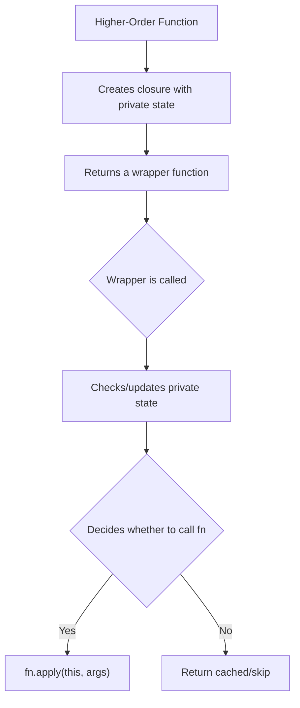

# Higher-Order Functions — Deep Dive with Execution Flows

> [!NOTE]
> A **higher-order function** is simply a function that either **takes a function as an argument** or **returns a new function**. All five functions below do both — they take a function `fn` and return a *new* function that wraps `fn` with extra behavior.

---

## 1. `once` — Execute a function only once

### 🧠 The Core Idea

**Real-world analogy:** Think of a door that locks permanently after you walk through it once. The first person gets through; everyone after sees the same room through the window but can't re-enter.

`once` wraps a function so that:
- The **first call** executes normally and **caches** the result
- Every **subsequent call** skips execution and **returns the cached result**

### 📖 The Code (Annotated)

```js
function once(fn) {
  let called = false;   // Flag: has fn been called yet?
  let result;           // Cache: stores the return value from the first call

  // Return a NEW function that "guards" fn
  return function(...args) {
    if (called) return result;   // Already called? Return cached result
    called = true;               // Mark as called
    result = fn.apply(this, args); // Call the original fn, store result
    return result;               // Return the result
  };
}
```

### 🔑 Key Concepts

| Concept | What it does here |
|---|---|
| **Closure** | The returned function "closes over" `called` and `result` — it remembers them across calls |
| **`fn.apply(this, args)`** | Calls `fn` with the correct `this` context and whatever arguments were passed |
| **`...args`** (rest params) | Collects all arguments into an array, so the wrapper works with any number of args |

### 🗺️ Execution Flow

```js
const initialize = once(() => {
  console.log("Initialized!");
  return { ready: true };
});
```

When `once()` is called, it creates a **closure environment**:

```
┌─────────────────────────────────┐
│  Closure (created by once)      │
│                                 │
│  fn = () => { ... }             │
│  called = false                 │
│  result = undefined             │
│                                 │
│  returned function: initialize  │
└─────────────────────────────────┘
```

#### Call 1: `initialize()`

```
Step 1: Enter the returned function
Step 2: Check → called === false → continue
Step 3: Set called = true
Step 4: Execute fn() → logs "Initialized!", returns { ready: true }
Step 5: Store result = { ready: true }
Step 6: Return { ready: true }

Closure state after:
  called = true ✅
  result = { ready: true }
```

#### Call 2: `initialize()`

```
Step 1: Enter the returned function
Step 2: Check → called === true → SKIP everything
Step 3: Return cached result → { ready: true }

(fn is NEVER called again. No console.log. Same result returned.)
```

#### Call 3: `initialize()` — Same as Call 2

```
Step 1: Enter the returned function
Step 2: Check → called === true → SKIP
Step 3: Return { ready: true }
```

### 📊 Visual Timeline

```
Call #   │ called (before) │ fn executes? │ console output  │ return value
─────────┼─────────────────┼──────────────┼─────────────────┼──────────────
   1     │     false       │     YES ✅   │ "Initialized!"  │ { ready: true }
   2     │     true        │     NO  ❌   │    (nothing)    │ { ready: true }
   3     │     true        │     NO  ❌   │    (nothing)    │ { ready: true }
```

### 🌍 When would you use this?

- **Database connections** — connect once, reuse the connection
- **App initialization** — set up config only once
- **Event handlers** — ensure a one-time setup runs exactly once

---

## 2. `pipe` — Compose functions left to right

### 🧠 The Core Idea

**Real-world analogy:** Think of an **assembly line** in a factory. A raw material enters from one end, each station transforms it, and a finished product comes out the other end.

`pipe` chains multiple functions together. The output of function 1 becomes the input of function 2, and so on.

### 📖 The Code (Annotated)

```js
function pipe(...fns) {
  // fns = array of all functions passed in
  
  return function(value) {
    // Process value through each function, left to right
    return fns.reduce((acc, fn) => fn(acc), value);
  };
}
```

### 🔑 Key Concepts

| Concept | What it does here |
|---|---|
| **`...fns`** (rest params) | Collects all function arguments into an array |
| **`reduce`** | Iterates through the array, passing each result to the next function |
| **`acc` (accumulator)** | The "running result" — starts as `value`, then becomes the output of each `fn` |

### Understanding `reduce` (the engine of `pipe`)

If you're not comfortable with `reduce`, here's what it does step by step:

```js
// reduce(callback, initialValue)
// callback receives: (accumulator, currentItem) => newAccumulator

[fn1, fn2, fn3].reduce((acc, fn) => fn(acc), startValue)

// Iteration 1: acc = startValue,     fn = fn1 → returns fn1(startValue)
// Iteration 2: acc = fn1(startValue), fn = fn2 → returns fn2(fn1(startValue))
// Iteration 3: acc = fn2(fn1(startValue)), fn = fn3 → returns fn3(fn2(fn1(startValue)))
```

### 🗺️ Execution Flow

```js
const processUser = pipe(
  (name) => name.trim(),         // fn1: remove whitespace
  (name) => name.toLowerCase(),  // fn2: convert to lowercase
  (name) => `@${name}`,          // fn3: add @ prefix
);
```

When `pipe()` is called:
```
┌──────────────────────────────────────────────┐
│  Closure (created by pipe)                   │
│                                              │
│  fns = [trim, toLowerCase, addPrefix]        │
│                                              │
│  returned function: processUser              │
└──────────────────────────────────────────────┘
```

#### Calling `processUser("  Alice  ")`

```
Input: "  Alice  "
        │
        ▼
┌───────────────────┐
│  fn1: trim()      │   "  Alice  " → "Alice"
└───────┬───────────┘
        │ "Alice"
        ▼
┌───────────────────┐
│  fn2: toLowerCase │   "Alice" → "alice"
└───────┬───────────┘
        │ "alice"
        ▼
┌───────────────────┐
│  fn3: add @       │   "alice" → "@alice"
└───────┬───────────┘
        │
        ▼
Output: "@alice"
```

#### Step-by-step `reduce` trace:

```
reduce starts with: acc = "  Alice  " (the initial value)

Iteration 1:
  acc = "  Alice  "
  fn  = (name) => name.trim()
  result = "  Alice  ".trim() = "Alice"
  acc is now: "Alice"

Iteration 2:
  acc = "Alice"
  fn  = (name) => name.toLowerCase()
  result = "Alice".toLowerCase() = "alice"
  acc is now: "alice"

Iteration 3:
  acc = "alice"
  fn  = (name) => `@${name}`
  result = "@alice"
  acc is now: "@alice"

reduce returns: "@alice"
```

### 🌍 When would you use this?

- **Data transformation pipelines** — clean, validate, format data in steps
- **Middleware chains** — process requests through a series of handlers
- **Text processing** — apply a sequence of string transformations

---

## 3. `curry` — Transform multi-arg functions into chainable single-arg functions

### 🧠 The Core Idea

**Real-world analogy:** Imagine ordering a custom pizza. Instead of specifying everything at once ("large pepperoni with extra cheese"), you can order step by step:
1. "I want a large" → returns a function waiting for toppings
2. "pepperoni" → returns a function waiting for extras  
3. "extra cheese" → now your pizza is complete!

`curry` lets you call a function with its arguments **one at a time** (or in groups). It keeps returning new functions until it has enough arguments, then it executes.

### 📖 The Code (Annotated)

```js
function curry(fn) {
  return function curried(...args) {
    // Do we have enough arguments?
    if (args.length >= fn.length) {
      // YES → call the original function
      return fn.apply(this, args);
    }
    // NO → return a new function that collects more arguments
    return function(...moreArgs) {
      // Combine old args + new args, try again
      return curried.apply(this, [...args, ...moreArgs]);
    };
  };
}
```

### 🔑 Key Concepts

| Concept | What it does here |
|---|---|
| **`fn.length`** | The number of parameters `fn` was **defined** with (e.g., `(a, b, c) => ...` has length 3) |
| **`args.length >= fn.length`** | Checks if we've collected enough arguments to call `fn` |
| **Named function expression** | `curried` is named so it can call itself recursively |
| **`[...args, ...moreArgs]`** | Merges previously collected args with newly provided args |

### 🗺️ Execution Flow

```js
const add = curry((a, b, c) => a + b + c);
// fn.length = 3 (needs 3 arguments)
```

#### Scenario A: `add(1, 2, 3)` — All at once

```
curried(1, 2, 3)
  args = [1, 2, 3]
  args.length (3) >= fn.length (3)? → YES ✅
  Execute: fn(1, 2, 3) = 1 + 2 + 3 = 6
  Return: 6
```

#### Scenario B: `add(1)(2)(3)` — One at a time

```
Step 1: add(1)
  curried(1)
  args = [1]
  args.length (1) >= fn.length (3)? → NO ❌
  Return: a new function that remembers [1]

Step 2: add(1)(2)  →  that new function is called with (2)
  (...moreArgs) where moreArgs = [2]
  Calls: curried(1, 2)  ← merges [1] + [2]
  args = [1, 2]
  args.length (2) >= fn.length (3)? → NO ❌
  Return: a new function that remembers [1, 2]

Step 3: add(1)(2)(3)  →  that new function is called with (3)
  (...moreArgs) where moreArgs = [3]
  Calls: curried(1, 2, 3)  ← merges [1, 2] + [3]
  args = [1, 2, 3]
  args.length (3) >= fn.length (3)? → YES ✅
  Execute: fn(1, 2, 3) = 6
  Return: 6
```

#### Scenario C: `add(1, 2)(3)` — Mixed

```
Step 1: add(1, 2)
  curried(1, 2)
  args = [1, 2]
  args.length (2) >= fn.length (3)? → NO ❌
  Return: a new function that remembers [1, 2]

Step 2: add(1, 2)(3)
  (...moreArgs) where moreArgs = [3]
  Calls: curried(1, 2, 3)  ← merges [1, 2] + [3]
  args.length (3) >= fn.length (3)? → YES ✅
  Execute: fn(1, 2, 3) = 6
  Return: 6
```

### 📊 Visual Decision Tree

```
                    curried(...args)
                         │
              ┌──────────┴──────────┐
              │  args.length >= 3?  │
              └──────────┬──────────┘
                    ╱          ╲
                 YES            NO
                  │              │
           Execute fn()    Return new function
           Return result   that waits for more args
                              │
                         When called with
                         more args, merge
                         all args and call
                         curried() again
                              │
                         (loop back to top)
```

### 🌍 When would you use this?

- **Reusable partially-applied functions:**
  ```js
  const multiply = curry((a, b) => a * b);
  const double = multiply(2);  // "pre-fill" first argument
  const triple = multiply(3);
  
  console.log(double(5));  // 10
  console.log(triple(5));  // 15
  ```
- **Configuration:** Pre-fill config values, pass the specialized function around

---

## 4. `debounce` — Delay execution until the user pauses

### 🧠 The Core Idea

**Real-world analogy:** Imagine an elevator door. Every time someone approaches, the door **resets its closing timer**. It only closes when nobody has approached for a certain number of seconds. The door "waits for a pause in activity."

`debounce` ensures a function only fires **after the caller stops calling it** for a specified delay.

### 📖 The Code (Annotated)

```js
function debounce(fn, delay) {
  let timeoutId;  // Stores the current timer

  return function(...args) {
    clearTimeout(timeoutId);   // CANCEL the previous timer (if any)
    
    timeoutId = setTimeout(() => {  // START a new timer
      fn.apply(this, args);          // When timer expires, call fn
    }, delay);
  };
}
```

### 🔑 Key Concepts

| Concept | What it does here |
|---|---|
| **`setTimeout`** | Schedules `fn` to run after `delay` milliseconds |
| **`clearTimeout`** | Cancels a previously scheduled `setTimeout` |
| **Every call resets the timer** | This is the key behavior — the function only fires when calls stop |
| **Closure** | `timeoutId` persists across calls, so each call can cancel the previous timer |

### 🗺️ Execution Flow

```js
const search = debounce((query) => {
  console.log("Searching for:", query);
}, 300);
```

#### Rapid calls: `search("h")`, `search("he")`, `search("hel")`, `search("hello")`

Imagine the user types one letter every 100ms:

```
Time (ms)  │ Action                │ Timer State
───────────┼───────────────────────┼────────────────────────────────
   0       │ search("h")           │ Set timer → fire at t=300
 100       │ search("he")          │ Cancel ❌ old timer
           │                       │ Set timer → fire at t=400
 200       │ search("hel")         │ Cancel ❌ old timer
           │                       │ Set timer → fire at t=500
 300       │ search("hello")       │ Cancel ❌ old timer
           │                       │ Set timer → fire at t=600
           │                       │
           │ ... user stops typing ...
           │                       │
 600       │ ⏰ Timer fires!       │ fn("hello") executes ✅
           │                       │ Logs: "Searching for: hello"
```

### 📊 Visual Timeline

```
t=0ms     t=100ms    t=200ms    t=300ms              t=600ms
  │          │          │          │                     │
  ▼          ▼          ▼          ▼                     ▼
"h"        "he"       "hel"    "hello"            fn("hello") ✅
  │          │          │          │                     │
  ├─ timer ──╳          │          │                     │
             ├─ timer ──╳          │                     │
                        ├─ timer ──╳                     │
                                   ├──── 300ms wait ─────┤
                                                    FIRES! 🎯

╳ = timer cancelled by next call
```

### 🧩 What happens inside the closure:

```
After search("h"):
  ┌─────────────────────────┐
  │ timeoutId = timer_1     │  ← will fire fn("h") at t=300
  └─────────────────────────┘

After search("he"):
  ┌─────────────────────────┐
  │ clearTimeout(timer_1)   │  ← timer_1 cancelled! "h" never fires
  │ timeoutId = timer_2     │  ← will fire fn("he") at t=400
  └─────────────────────────┘

After search("hel"):
  ┌─────────────────────────┐
  │ clearTimeout(timer_2)   │  ← timer_2 cancelled!
  │ timeoutId = timer_3     │  ← will fire fn("hel") at t=500
  └─────────────────────────┘

After search("hello"):
  ┌─────────────────────────┐
  │ clearTimeout(timer_3)   │  ← timer_3 cancelled!
  │ timeoutId = timer_4     │  ← will fire fn("hello") at t=600
  └─────────────────────────┘

... 300ms of silence ...

  timer_4 fires → fn("hello") → "Searching for: hello" ✅
```

### 🌍 When would you use this?

- **Search-as-you-type** — don't send API request on every keystroke
- **Window resize** — recalculate layout only after user finishes resizing
- **Auto-save** — save the document after user stops editing

---

## 5. `throttle` — Execute at most once per interval

### 🧠 The Core Idea

**Real-world analogy:** Think of a **security guard at a gate** who lets one person through every 5 minutes. If 10 people arrive in the first minute, only the first gets through. The guard then blocks everyone until the 5-minute window resets.

`throttle` ensures a function fires **at most once per time interval**, regardless of how many times it's called.

### 📖 The Code (Annotated)

```js
function throttle(fn, interval) {
  let lastCall = 0;  // Timestamp of last execution (starts at 0 = epoch)

  return function(...args) {
    const now = Date.now();  // Current timestamp in ms

    if (now - lastCall >= interval) {  // Enough time passed?
      lastCall = now;                   // Update the timestamp
      fn.apply(this, args);            // Execute!
    }
    // Otherwise: silently ignore the call
  };
}
```

### 🔑 Key Concepts

| Concept | What it does here |
|---|---|
| **`Date.now()`** | Returns current time in milliseconds since Jan 1, 1970 |
| **`now - lastCall >= interval`** | Checks if enough time has passed since the last execution |
| **`lastCall = 0`** | Starting at 0 means the first call always passes (since `now` is always huge) |
| **Ignored calls** | Unlike debounce, excess calls are simply **dropped**, not delayed |

### 🗺️ Execution Flow

```js
const handleScroll = throttle(() => {
  console.log("Scroll event handled!");
}, 1000);  // At most once per second
```

#### Rapid calls every 200ms over 2.5 seconds:

```
Time (ms)  │ Call           │ now - lastCall │ >= 1000? │ Executes?
───────────┼────────────────┼────────────────┼──────────┼──────────
     0     │ handleScroll() │  huge (first)  │   YES    │  ✅ fn()    lastCall = 0
   200     │ handleScroll() │     200        │   NO     │  ❌ skip
   400     │ handleScroll() │     400        │   NO     │  ❌ skip
   600     │ handleScroll() │     600        │   NO     │  ❌ skip
   800     │ handleScroll() │     800        │   NO     │  ❌ skip
  1000     │ handleScroll() │    1000        │   YES    │  ✅ fn()    lastCall = 1000
  1200     │ handleScroll() │     200        │   NO     │  ❌ skip
  1400     │ handleScroll() │     400        │   NO     │  ❌ skip
  1600     │ handleScroll() │     600        │   NO     │  ❌ skip
  1800     │ handleScroll() │     800        │   NO     │  ❌ skip
  2000     │ handleScroll() │    1000        │   YES    │  ✅ fn()    lastCall = 2000
  2200     │ handleScroll() │     200        │   NO     │  ❌ skip
  2400     │ handleScroll() │     400        │   NO     │  ❌ skip
```

### 📊 Visual Timeline

```
t=0    200   400   600   800  1000  1200  1400  1600  1800  2000  2200  2400
 │      │     │     │     │     │     │     │     │     │     │     │     │
 ▼      ▼     ▼     ▼     ▼     ▼     ▼     ▼     ▼     ▼     ▼     ▼     ▼
 📞    📞    📞   📞    📞    📞   📞    📞    📞    📞   📞   📞    📞
 ✅    ❌    ❌   ❌    ❌   ✅   ❌    ❌    ❌    ❌   ✅   ❌    ❌
 │                              │                              │
 └── fires ─────────────────────┘── fires ─────────────────────┘── fires───
     (1 sec gap)                           (1 sec gap)
```

### 🌍 When would you use this?

- **Scroll events** — update position indicator at most once per 100ms
- **Button clicks** — prevent accidental double-submits
- **API polling** — limit rate of requests to a server

---

## 🔄 Debounce vs Throttle — Side by Side

This is the most common confusion. Here's a clear comparison:

```
User fires events rapidly for 2 seconds, then stops.
Interval/delay = 500ms.

DEBOUNCE (waits for silence):
Events:  ⚡⚡⚡⚡⚡⚡⚡⚡⚡⚡⚡⚡ ............
Fires:                                       🔥 (once, 500ms after last event)

THROTTLE (fires at intervals):
Events:  ⚡⚡⚡⚡⚡⚡⚡⚡⚡⚡⚡⚡ ............
Fires:   🔥        🔥        🔥        🔥
         (every 500ms during activity)
```

| Feature | Debounce | Throttle |
|---|---|---|
| **When it fires** | After a **pause** in calls | At **regular intervals** during calls |
| **During rapid calls** | Never fires (keeps resetting) | Fires periodically |
| **After calls stop** | Fires once (after delay) | Doesn't fire (already did) |
| **Best for** | "Wait until they're done" | "Don't do this too often" |
| **Mental model** | Elevator door | Security guard at a gate |

---

## 🧬 The Common Pattern

All five functions share the same structure — **closure + function wrapping**:

```
function higherOrderFn(fn, ...config) {
  // 1. Create private state in the closure
  let state = ...;

  // 2. Return a new function that:
  return function(...args) {
    // 3. Uses the private state to decide behavior
    // 4. Optionally calls fn with fn.apply(this, args)
    // 5. Optionally updates the private state
  };
}
```



| Function | Private State | Decision Logic |
|---|---|---|
| `once` | `called`, `result` | Has `fn` been called before? |
| `pipe` | `fns` (array) | Always runs all — chains them via reduce |
| `curry` | `args` (accumulated) | Do we have enough arguments yet? |
| `debounce` | `timeoutId` | Reset timer on every call |
| `throttle` | `lastCall` (timestamp) | Has enough time passed? |
